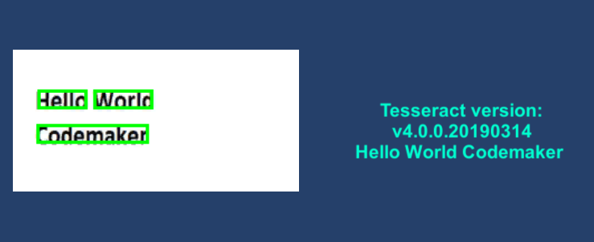

# Standalone OCR for Unity using Tesseract 

This is a sample project that sets up API and Dependencies to use Tesseract for different platforms. 

## Requires
- Unity


## Usage
The Demo Scene (Main) portrays how one can use the classes via TesseractDemoScript

### 1. Create and Setup a new Driver
```
TesseractDriver tesseractDriver = new TesseractDriver();
tesseractDrriver.Setup(OnSetupComplete)
```
#### Parameter:
UnityAction onSetupComplete -- Action called when Tesseract is successfully set up

### 2. Recognize from a Texture
```
string recognizedText = tesseractDriver.Recognize(texture)
```
#### Parameter: 
Texture2D texture -- The texture that the driver will look for characters in

### 3. Get Highlighted Texture
```
Texture2D highlightedTexture = tesseractDriver.GetHighlightedTexture()
```


## How it looks
* Add your images under Images folder and make the image as Read/Write enable by changing checking Read/Write enable option from the advance menu on the inspector.

